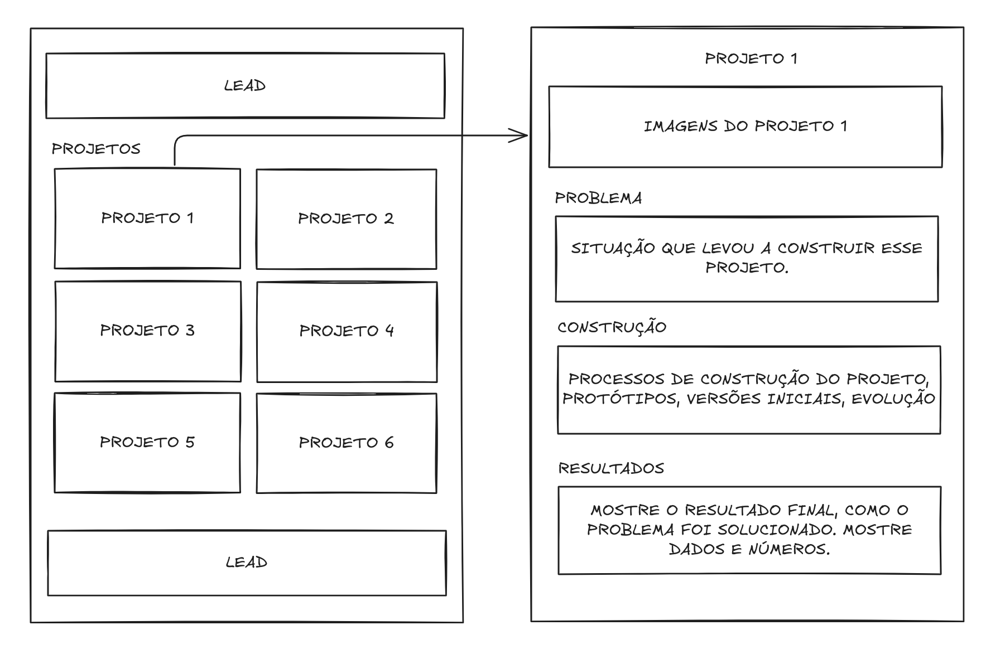
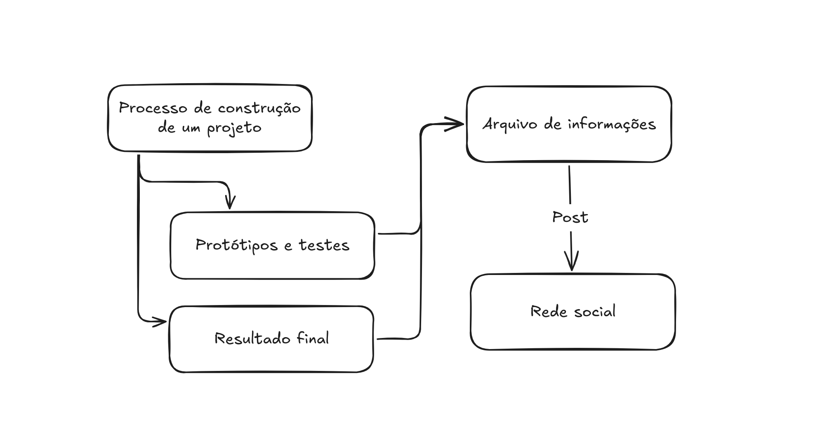

# Caminho Freelancer na Tecnologia
Como você está aqui imagino que esteja a procura de um conteúdo objetivo, que não seja listas de dicas na internet que pouco dizem, sobre carreira freelancer. Trabalho como freelancer há anos e quando comecei havia muito pouco conteúdo sobre esse assunto na internet. Mesmo hoje, você raramente vê algo que se aprofunde de maneira objetiva sobre o assunto. Pensando nisso, venho trazer um caminho para reduzir o tempo que você levaria descobrindo tudo isso por conta própria.

## Considerações importantes
Não faça das minhas palavras a verdade absoluta. Essa é a apenas a maneira em que trabalho nos dias atuais, mas ela pode ser atualizada ao longo do tempo. Pegue o que for favorável e tente aplicar pra seu fluxo de trabalho.

Eu sou desenvolvedor de software, então muito do que posso dizer é relacionado a essa realidade. Porém, sinta-se a vontade para adaptar pra sua atividade.

## O que é Freelancer?
Antes de tudo, acho importante deixar claro o que é trabalhar como freelancer. O trabalho freelancer é um tipo de trabalho que se baseia em entregas ou projetos, sem vínculo empregatício com seu contratante. Desse modo, o profissional freelancer é aquele que presta um serviço mediante um escopo específico.

### Mitos
Alguns mitos que é importante que desmentir sobre o trabalho freelancer:
- **Liberdade**: É verdade que seu trabalho como freelancer pode ser bem flexível e abrir portas para uma boa qualidade de vida. Porém, para alcançar esse estágio você vai, provavelmente, trabalhar mais que um profissional que é funcionário de alguma empresa.
- **Trabalhar sozinho:** Muitas pessoas buscam trabalhar como freelancer para fugir da necessidade de comunicação e trabalho em equipe. Não poderiam estar mais enganados, a verdade é que você trabalhando como freelancer vai trabalhar com muita comunicação e eventualmente vai integrar uma equipe. Não queira fugir das pessoas.

Esclarecido isso, podemos começar.

## Portfólio
Uma parte fundamental desse regime de trabalho é prospeção de clientes, e para que isso seja feito é necessário um portfólio.

### O que é um portfólio?
O portfólio é uma vitrine onde um profissional exibe seus trabalhos e serviços. É lá em que ele deixa claro os processos e os resultados que permeiam sua atividade. Portanto, é necessário ter um portfólio.

Quando se trabalha como freelancer, eventualmente um possível cliente novo irá se interessar pelo trabalho oferecido. Todavia, para converter esse visitante em um cliente, é necessário convencê-lo de que o serviço oferecido é o melhor para atender as necessidades dele.

### Como é feito um portfólio?
Para que o dever de um portfólio seja cumprido com primor, ele precisa estar recheado de projetos. Até porque, de nada vale uma vitrine vazia.

Repare que aqui não existe uma distinção entre projetos comerciais ou projetos pessoais, pode-se exibir tanto um quando o outro. Por isso, é importante que os projetos reflitam na melhor qualidade do serviço.

#### O que fazer se não tenho projetos o suficiente?
Nesse caso não há para onde fugir, nem como se esconder. Projetos são primordiais. São eles que vão deixar claro todo o potencial de um profissional. Os clientes não se importam com um currículo com dezenas de siglas, eles querem ver resultados concretos e tangíveis.

#### Anatomia de um portfólio

Um bom portfólio é simples, objetivo e reflete a organização do trabalho.
- **Lead:** O Lead é uma ferramenta do marketing para conversões. Nesse tópico, é importante instigar o cliente a efetuar uma ação estratégica, seja ela: marcar uma conversa, cadastrar-se em uma lista de emails ou comunicar-se com você. É muito eficaz repetir o lead no final, diminui as chances da pessoa desistir após percorrer seu portfólio e abandonar a página.
- **Projetos**: É fundamental expor os melhores trabalhos construídos, mostrando variedade dentro da especificidade. Isso significa que um desenvolvedor deve ser específico em manter-se exibindo produtos de software, e não algo que tangencie para um lugar em que o cliente não teria interesse. E ao mesmo tempo, deve demonstrar versatilidade com diversos tipos de projetos, dentro da área de expertise.
  > Para deixar mais fácil de entender, um desenvolvedor deveria dar foco especial a projetos de software completos, como: APIs, sites, ferramentas construídas. E não colocar conteúdo não relacionado (projetos em outras profissões, que não tenha relação com o assunto).

- **Problema**: Todo projeto começa com um problema, evidenciar ele da melhor forma permite   que o cliente entenda a capacidade do profissional em solucionar problemas. Descrever como o problema impacta e quais seus prejuízos a longo prazo deixa claro a maturidade de planejamento do freelancer.
- **Construção**: Uma boa maneira de mostrar como é a organização e o modo de realizar uma tarefa é documentar o processo de construção. O uso de prints, diagramas, e explicações sobre os desafios e pontos relevantes de um projeto demonstra a capacidade de organização, documentação e trabalho colaborativo de um profissional.
- **Resultados**: No fim das contas, esse é o ponto em que um cliente estará realmente interessado. Os resultados são um conjunto de benefícios que aconteceram ao resolver o problema. Desse modo, resultado é uma medida comparativa, por isso é preciso deixar evidente por meio de comparações de como estava antes e como ficou após a solução. Evidencie com imagens do resultado final, gráficos comparativos, métricas e qual seria um próximo passo para continuar a melhoria ou manter esse novo estado.
  > Para alguns projetos os resultados visuais são partes fundamentais, então demonstrar com uma montagem de imagens de qualidade permite assegurar a sua capacidade de comunicação. Entretanto, nem todos projetos não dispõe de um resultado visual, por isso, busque medidas comparativas do antes e depois. Por fim, descreva os caminhos lógicos com diagramas.

### Redes sociais
É inegável que a presença nas redes sociais representa uma ferramenta poderosa em divulgar um trabalho. Outrossim, o uso inteligente da exposição online pode alavancar o alcance e, assim, conseguir novos clientes. Existe um pequeno processo que permite otimizar a produção do conteúdo:

1. Durante o Processo de construção de um projeto, faça sempre a documentação dos seus processos. O que está sendo feito, quais desafios enfrentados e soluções interessantes. Guarde isso em um lugar de fácil busca (Arquivo de Informações), como Notion ou Obsidian.
2. Organize os registros dos protótipos e testes mantendo uma linearidade e com um bom storytelling. Nesse ponto, você tem seu primeiro post do projeto.
3. Com o tempo, você chegará no resultado final. Com o resultado final, faça um comparativo com os protótipos e testes mostrando como se deu a evolução do projeto. Com isso, você tem um segundo post.
  > Garanta imagens de boa qualidade. Nenhuma delas precisam estar perfeitas, muito menos ser um longo vídeo explicativo. Um conjunto de imagens, um gif, ou um vídeo curto é suficiente. 
4. Agora chegou a hora de lançar seu trabalho ao mundo, escolha estrategicamente seus veículos de comunicação, adeque seu conteúdo que está em no Arquivo de Informações para a linguagem de cada plataforma.
  > A escolha da plataforma depende muito do seu tipo de trabalho. Designers costumam usar muito o Instagram, Behance e Dribble. Algumas dessas talvez não seja a mais adequada para desenvolvedores, por exemplo. Recomendo que teste e encontre aquelas que permitirem um melhor retorno.

### Tráfego pago
Para finalizar o assunto sobre portfólio, uma pequena explorada sobre o assunto tráfego pago. Seja onde estiver seu portfólio: em um site, nas redes sociais ou em ambos; é possível impulsionar artificialmente seu alcance com técnicas de tráfego pago. Ferramentas como Google ADS, ou os próprios recursos pagos das redes sociais permite a captação de um público altamente direcionado, o que pode significar maiores chances de conversão de um cliente. Apesar disso, custos com tráfego pago podem ser proibitivos para iniciantes. Por isso, seu uso parte de uma análise de resultado em relação a aplicação financeira.

<!-- ## Lidando com clientes
Com seu portfólio estruturado e alcançável (seja por tráfego pago ou orgânico), é esperado que comece a receber propostas de clientes. Por isso precisa entender como lidar com eles. 
 -->
